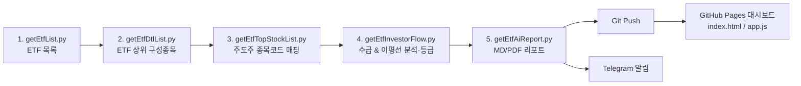

# 📘 PRD — 네이버 ETF 주도주 수급 & 추세추종 분석 시스템 (`stockNaverEtf`)

| 항목 | 내용 |
| :--- | :--- |
| 문서 버전 | v1.0 |
| 작성일 | 2026-10-09 |
| 근거 문서 | `README.md`, `docs/etf_분석.md`, `docs/추세추종.md`, `docs/stockDesc1.md`, `docs/stockDesc2.html`, `docs/차트.md`, `docs/dashboard.md`, `docs/macExec.md`, `docs/실시간감지.md` |
| 상태 | 파이프라인·대시보드 운영 중 / 포트폴리오 실시간 손절 감시는 설계 단계 |

---

## 1. 제품 개요

### 1.1 한 줄 정의
네이버 증권 API로 **국내 주식형 ETF의 상위 구성종목(주도주)** 을 매일 수집하고, **외국인·기관 동시 순매수(쌍끌이)** 와 **이동평균선 정배열 추세**를 결합해 **투자등급(A+ / A / B / C)** 을 자동 산출한 뒤, 리포트·웹 대시보드·텔레그램으로 전달하는 **개인 투자자용 추세추종 의사결정 지원 시스템**.

### 1.2 배경 및 문제
- 개인 투자자는 수천 개 종목 중 "지금 메이저 자금이 들어오는 종목"을 매일 찾기 어렵다.
- 장중 잠정 수급은 신뢰도가 낮고, 직장인은 장중에 시세를 볼 시간이 없다.
- 감(感)에 의한 물타기·추격매수로 원금 손실이 커진다.

### 1.3 해결 방안
1. **유니버스 축소**: ETF 상위 구성종목 = 시장이 인정한 주도주(약 500개)로 분석 대상을 한정.
2. **정량 등급화**: 수급(쌍끌이·연속매수) + 추세(20일선·정배열) + 과열(이격도) 지표를 규칙 기반으로 등급화.
3. **장 마감 후 자동화**: 16:00 이후 확정 수급으로 분석 → 리포트 생성 → Git 배포 → 텔레그램 알림.
4. **매매 규칙 내재화**: 피라미드 분할매수, -3% 손절, 본전 방어 등 리스크 관리 원칙을 리포트·가이드에 함께 제시.

### 1.4 목표 (Goals)
| # | 목표 | 성공 지표 |
| :-: | :--- | :--- |
| G1 | 매 거래일 장 마감 후 분석 결과 자동 생성 | 영업일 자동 실행 성공률 ≥ 95% (`reports/log_YYYYMMDD.txt` 기준) |
| G2 | 1분 안에 매수 후보 파악 | 대시보드 첫 화면에서 A+/A·신규 승격·연속 A+ 종목 즉시 노출 |
| G3 | 원금 손실 통제 | 매매 가이드 준수 시 1차 진입 손실 ≤ 전체 원금의 -1.2% |
| G4 | 무설치·무서버 운영 | Python 표준 라이브러리만 사용, 정적 호스팅(GitHub Pages) |

### 1.5 비목표 (Non-Goals)
- 증권사 API 연동을 통한 **자동 주문 체결**은 하지 않는다 (매매는 사용자가 HTS/MTS에서 직접 수행).
- 해외주식·채권·파생·원자재 ETF는 분석 대상에서 제외한다.
- 투자 수익을 보장하지 않는다. 본 시스템은 의사결정 **보조 도구**이다.

---

## 2. 대상 사용자 (Persona)

| 페르소나 | 특징 | 핵심 니즈 |
| :--- | :--- | :--- |
| **직장인 스윙 투자자** (주 사용자) | 장중 시세 확인 불가, 퇴근길 1분 확인 | 16시 확정 수급 기반 후보 종목 + 시간외 단일가 종가매매 가이드 |
| **초보 추세추종 투자자** | 매매 원칙 부족, 손실 공포 | 명확한 등급·우선순위·손절 규칙 |
| **운영자(본인)** | macOS 로컬에서 파이프라인 운영 | cron 자동 실행, 로그, 텔레그램 수신 |

---

## 3. 사용자 시나리오

1. **16:05** macOS cron이 `main.py --step 4,5 --push-git --telegram` 실행.
2. 수급·이평선 분석 → `reports/report_YYYYMMDD.csv` / `.md` (옵션: PDF) 생성.
3. Git 자동 커밋(`주식분석_자동화_YYYYMMDD`) & 푸시 → GitHub Pages 대시보드 갱신.
4. 텔레그램으로 **A+ 등급 종목명 – 섹터** 요약 수신.
5. 사용자는 대시보드에서 A+/A 등급, 과열 여부, 캔들 꼬리, 매수 우선순위를 확인.
6. 16:00~18:00 시간외 단일가로 1차(40%) 매수 → 체결 즉시 -3% 스탑로스 등록.
7. 다음 날 갭상승 시 50% 익절, 잔량은 스윙 추세추종 / 피라미드 불타기.

---

## 4. 시스템 구성

| 계층 | 구성 | 기술 |
| :--- | :--- | :--- |
| 데이터 수집·분석 | `getEtf*.py` 5단계 스크립트 | Python 3.8+ 표준 라이브러리 (`urllib`, `json`, `csv` 등) |
| 오케스트레이션 | `main.py` (대화형 메뉴 + CLI 옵션) | `argparse`, `subprocess` |
| 스케줄링 | macOS `pmset` 15:58 기상 + `crontab` 16:05 실행 | OS 기능 |
| 배포 | Git 자동 커밋/푸시 → GitHub Pages | 정적 호스팅 |
| 프론트엔드 | `index.html`, `style.css`, `app.js` | Vanilla JS, PapaParse, Marked, Chart.js, Mermaid |
| 알림 | 텔레그램 Bot (텍스트 + PDF 첨부) | `.env` (`TELEGRAM_BOT_TOKEN`, `TELEGRAM_CHAT_ID`) |
| 외부 데이터 | 네이버 증권 모바일 API (`m.stock.naver.com/api/stock/{code}/price`, `/trend` 등) | HTTP JSON |

---

## 5. 기능 요구사항

### F1. 데이터 수집 파이프라인 (1~3단계)
| ID | 요구사항 | 산출물 |
| :--- | :--- | :--- |
| F1-1 | 국내 주식형 ETF(카테고리 `1` 국내 시장지수, `2` 국내 업종/테마)만 수집 (약 439개) | `data/etf_list.csv` |
| F1-2 | ETF별 상위 N개(기본 10, `--top-n`) 구성종목 수집 | `data/etf_dtl_list.csv` |
| F1-3 | 구성종목을 6자리 종목코드·종목명·네이버 상세페이지 URL로 정제/매핑, 빈도순 정렬 (약 500여 개) | `data/etf_top_stocks.csv` |

> 1~3단계는 최초 구축(`--all`) 또는 주기적 유니버스 갱신 시 실행.

### F2. 수급 & 추세 분석 및 등급 산출 (4단계)
- **F2-1 거래일 감지**: 네이버 API에서 최신 마감 거래일 자동 감지, `--date YYYYMMDD`로 특정일 지정 가능.
- **F2-2 수급 지표**: 외국인 보유율, 외국인/기관 연속 순매수 일수(최대 5일), 최근 3일 순매수 수량, 쌍끌이 여부.
- **F2-3 추세 지표**: 최근 120영업일 종가로 MA5/MA20/MA60/MA120 단순이동평균 계산.
  - `20일선위` = 현재가 ≥ MA20
  - `정배열여부` = MA5 ≥ MA20 ≥ MA60 ≥ MA120
  - `20일이격도` = 현재가 / MA20 × 100
- **F2-4 과열 판정**: 이격도 97~108% `적정(안전)`, 108~115% `상승과열`, ≥115% `단기과열(경계)`, <97% `이격과도`.
- **F2-5 투자등급**:

| 등급 | 조건 | 의미 |
| :-: | :--- | :--- |
| **A+** | 쌍끌이(O) + 20일선위(O) + 정배열(O) | 최상위 대세상승주 |
| **A** | 쌍끌이(O) + 20일선위(O) | 우량 수급 상승주 (눌림목 1차 매수 적합) |
| **B** | 쌍끌이(O) 또는 20일선위(O) | 관찰 대상 |
| **C** | 조건 미충족 | 매수 관망 |

- **F2-6 부가 지표**: 추세단계(`정배열가속(A+)` / `수급우량(A)` / `추세초입(B)` / `단기과열(경계)` / `관망(C)`), 추천매수가(MA20~MA5 지지 구간), 대표 섹터/테마 자동 분류.
- **F2-7 등급 변동**: 직전 거래일 결과와 비교하여 `등급변동`(예: `A -> A+ (상향)`)과 `변동이유` 기록.
- **산출물**: `reports/report_YYYYMMDD.csv` — 컬럼:
  `종목코드, 종목명, 섹터, 투자등급, 등락률, 등급변동, 변동이유, 현재가, 외국인보유율, 쌍끌이여부, 외국인연속매수(일), 기관연속매수(일), 최근3일외인순매수, 최근3일기관순매수, 20일선위, 정배열여부, 20일이격도, 과열여부, 추세단계, 추천매수가, MA5, MA20, MA60, MA120, 상세페이지`

### F3. AI 분석 리포트 (5단계)
- F3-1 CSV 기반 마크다운 리포트 자동 작성: 등급 분포, A+/A 주도주 요약, 등급 상향/하향 하이라이트, 피라미딩 매매·리스크 관리 가이드.
- F3-2 `--pdf` 옵션 시 PDF 리포트 추가 생성.
- **산출물**: `reports/report_YYYYMMDD.md`, (옵션) PDF.

### F4. 실행·자동화 (`main.py`)
| 옵션 | 동작 |
| :--- | :--- |
| (인자 없음) | 대화형 메뉴, 엔터 시 4·5단계 실행 |
| `--all` / `--step 1-5` / `--step 4,5` | 전체 또는 지정 단계 실행 |
| `--step1`~`--step5` (`--etf-list`, `--etf-dtl`, `--top-stocks`, `--investor-flow`, `--ai-report`) | 단계별 실행 |
| `--date`, `--limit`, `--top-n`, `--pdf` | 대상일, 테스트용 종목 수 제한, ETF당 수집 개수, PDF 생성 |
| `--push-git` / `--push-git-only` | 분석 후 / 단독 Git 커밋·푸시 |
| `--telegram` / `--telegram-only` | 분석 후 / 단독 A+ 종목 텔레그램 발송 |
| `--bot-token`, `--chat-id` | 텔레그램 자격 정보 직접 전달 (기본은 `.env`) |

- F4-1 안전 기본값: 옵션 미지정 시 Git 푸시·텔레그램 발송을 하지 않는다.
- F4-2 실행 로그(시작/종료 시각, 소요 시간, 푸시·전송 성공 여부)를 `reports/log_YYYYMMDD.txt`에 기록.
- F4-3 macOS 스케줄: `pmset repeat wakeorpoweron MTWRF 15:58:00` + `crontab` `5 16 * * 1-5` 권장 (수급 최종 집계 15:45~16:00 마감 고려).

### F5. 웹 대시보드 (GitHub Pages)
레이아웃: **GNB(헤더) + LNB(날짜/메뉴 사이드바) + 메인 콘텐츠** 3분할, 백엔드 없이 브라우저에서 CSV/MD 직접 파싱.

| ID | 영역 | 요구사항 |
| :--- | :--- | :--- |
| F5-1 | GNB | 타이틀, 최근 마감일, 분석 종목 수, 다크/라이트 모드 토글 |
| F5-2 | LNB | 통합 대시보드 메뉴, 날짜별 리포트 목록(최신순), 등급 빠른 필터, 달력 기반 날짜 선택(오늘 날짜 동적 감지) |
| F5-3 | KPI 카드 | A+ 수/비율, A 수/비율, 신규 A+ 편입 수, 쌍끌이 종목 수 |
| F5-4 | 연속 A+ 챔피언 | 최근 3~5거래일 연속 A+ 유지 종목 (최근 N개 CSV 교차 연산) |
| F5-5 | 신규 A+ 승격 | 직전일 A/B → 금일 A+ 종목 하이라이트 |
| F5-6 | 등급 분포 추이 | 날짜별 A+/A/B/C 비율 차트 (Chart.js) |
| F5-7 | 데이터 그리드 | 종목명/코드 검색, 등급·정배열 필터, 캔들(꼬리) 다중 선택 필터, 네이버 증권 링크 |
| F5-8 | 일별 리포트 뷰 | `report_YYYYMMDD.md`를 HTML로 렌더링 (Marked, Mermaid) |
| F5-9 | 전략 가이드 | `stockDesc1`(추세추종·종가매매), `stockDesc2`(매수 우선순위) 가이드 페이지 |
| F5-10 | 반응형 | 모바일~데스크톱 대응 타이포그래피·레이아웃 |

### F6. 텔레그램 알림
- F6-1 분석 완료 후 **A+ 등급 종목명 – 섹터** 요약 메시지 발송.
- F6-2 PDF 리포트 존재 시 문서 첨부 발송.
- F6-3 토큰/채팅 ID 미설정 시 발송을 건너뛰고 로그에 기록.

### F7. 매매 전략 가이드 (콘텐츠 요구사항)
시스템이 리포트·대시보드로 제공해야 하는 매매 원칙:

**(a) 피라미드 분할매수 (`추세추종.md`, `stockDesc1`)**
| 단계 | 비중 | 조건 | 안전장치 |
| :-: | :-: | :--- | :--- |
| 1차 | 40% | A+/A 등급, 과열 아님, 쌍끌이 확인 | 매수가 대비 -3% 손절 (원금 대비 -1.2%) |
| 2차 | 30% | 1차 대비 +3~5% 상승 & 수급 유지 | 스탑로스를 1차 매수가(본전)로 상향 |
| 3차 | 20% | 추가 +5% 이상 상승 | — |
| 4차 | 10% | 시세 분출 지속 | 최고점 대비 -5~-7% 트레일링 스탑 익절 |
- 물타기(하락 시 추가매수) 금지, 단기과열(이격도 ≥115%) 종목 추격매수 금지.

**(b) 오후 4시 종가매매**: 16:00 확정 수급 확인 → 16:00~18:00 시간외 단일가 1차 매수 → 다음 날 시초가 +2~5% 갭상승 시 50% 익절, 잔량 스윙.

**(c) 매수 우선순위 (`stockDesc2`)**
| 순위 | 등급 | 캔들 | 과열 | 추천 비중 |
| :-: | :-: | :--- | :--- | :-: |
| 1순위 (S급 눌림목) | A | 망치형/아래꼬리 | 적정 | 30~50% |
| 2순위 (정배열 불타기) | A+ | 양봉/아래꼬리 | 적정 | 20~30% |
| 3순위 (단기 스캘핑) | A+/A | 아래꼬리 | 상승과열 | 10~20% |
| 4순위 (정찰대) | A/B | 망치형 | 적정/이격과도 | <10% |
- **절대 매수 금지**: 긴 윗꼬리 + 단기과열(≥115%), 이격과도(<97%) + C등급.

**(d) 캔들 꼬리 해석 (`차트.md`)**: 긴 아래꼬리=지지/반등, 긴 윗꼬리=매도압력/조정, 망치형·유성형·십자형 패턴, 20일선 부근 아래꼬리 + A등급 = 최적 눌림목.

---

## 6. 로드맵 (미구현 / 향후 기능)

### P1. 내 포트폴리오 실시간 손절 감시 (`실시간감지.md`) — *설계 완료, 미구현*
- **데이터 모델**: `data/my_portfolio.json` (`code, name, buyPrice, quantity, buyDate, stopLossPercent, targetProfitPercent, pyramidStep, status`).
- **손절 알고리즘**
  1. 매수가 대비 수익률 ≤ -3% → 손절 경고
  2. 전일 종가 대비 ≤ -3% 급락 → 매도 경고
  3. 2차 매수 후 현재가 ≤ 1차 매수가 → 본전 방어 전량 매도 경고
- **모듈 A (웹)**: 대시보드 `💼 내 포트폴리오` 탭, 매수 종목 등록 폼, 1~3분 주기 시세 폴링, 점멸 카드·경고음·모달.
- **모듈 B (Python)**: `monitorPortfolio.py`, 장중(09:00~15:30) 1분 주기 감시, 텔레그램 긴급 알림.

### P2. 기타 개선 후보
- 연기금 수급 세분화 (`연기금연속매수(일)`, `최근3일연기금순매수` 컬럼 추가).
- 주 단위 유니버스(ETF 구성종목) 변경 모니터링.
- 등급별 사후 성과(백테스트) 추적으로 등급 기준 검증.

---

## 7. 비기능 요구사항

| 구분 | 요구사항 |
| :--- | :--- |
| 이식성 | Windows/macOS/Linux, Python 3.8+, 외부 패키지 설치 불필요 |
| 성능 | 4·5단계 약 500종목 분석이 장 마감 후 수 분 내 완료 |
| 비용 | 서버·DB 없음, GitHub Pages 무료 호스팅 |
| 보안 | 텔레그램 토큰은 `.env`로 관리하고 Git에 커밋하지 않음 (`.gitignore`) |
| 안정성 | 외부 API 실패 시 종목 단위로 건너뛰고 전체 파이프라인은 계속 진행, 로그 기록 |
| 데이터 보존 | 일자별 CSV/MD 누적 보관 → 등급 변동·연속 A+ 계산의 근거 |

---

## 8. 리스크 및 제약

| 리스크 | 영향 | 대응 |
| :--- | :--- | :--- |
| 네이버 비공식 API 스펙 변경/차단 | 수집 실패 | 로그 모니터링, 파서 분리로 빠른 수정 |
| 수급 집계 지연 (16:00 전후) | 부정확한 등급 | 16:05 실행 권장, `--date` 재실행 |
| 맥 절전/네트워크 오류 | 자동 실행 누락 | `pmset` 자동 기상, `--push-git-only`·`--telegram-only` 재처리 |
| 규칙 기반 등급의 한계 | 잘못된 매수 신호 | 손절 규칙 강제, 투자 판단 책임 고지 |
| 기관 수급 합산 데이터 | 연기금 등 세부 주체 구분 불가 | P2 연기금 세분화 |

---

## 9. 용어 정리

| 용어 | 정의 |
| :--- | :--- |
| 주도주 | 국내 주식형 ETF 상위 구성종목에 자주 편입된 종목 |
| 쌍끌이 | 외국인과 기관이 동시에 순매수 |
| 정배열 | MA5 ≥ MA20 ≥ MA60 ≥ MA120 |
| 20일 이격도 | 현재가 / MA20 × 100 |
| 불타기 | 수익 중일 때만 추가 매수 (↔ 물타기) |
| 본전 방어 스탑로스 | 2차 매수 후 손절가를 1차 매수가로 올려 손실 0원 확보 |
| 시간외 단일가 | 16:00~18:00, 10분 단위 체결되는 장후 거래 |
