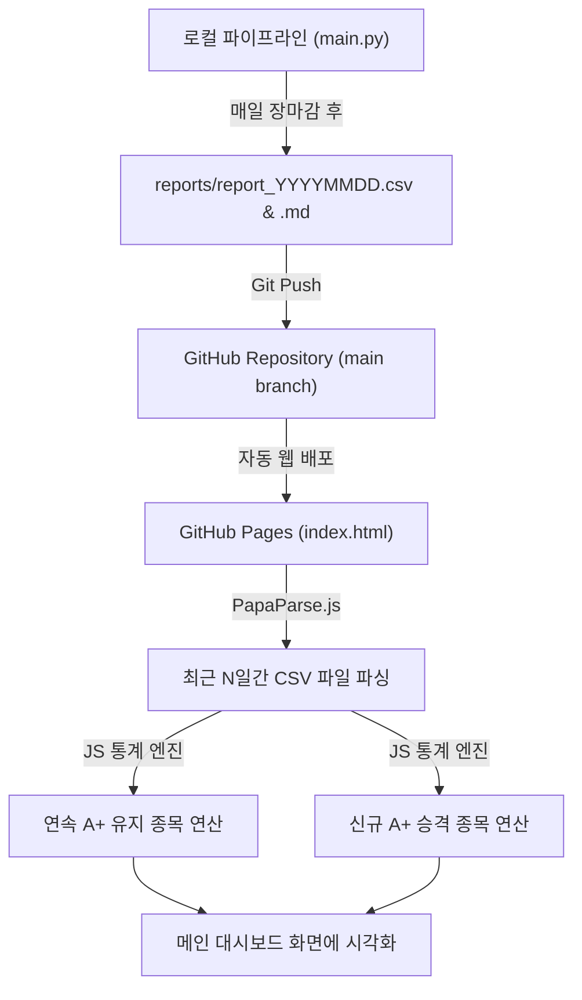

# 📊 네이버 주식 ETF 주도주 수급 대시보드 기획 및 웹 화면 구성 가이드 (`docs/dashboard.md`)

본 문서는 **GitHub Pages**를 통해 서비스될 **ETF 주도주 수급 & 추세추종 대시보드 웹 애플리케이션(`index.html`)**의 화면 구조, 레이아웃 기획, 데이터 처리 방안 및 개발 방향성을 정리한 통합 기획서입니다.

---

## 1. 🎯 프로젝트 개요 및 기획 목적

* **서비스 목적**: 파이썬 파이프라인(`main.py`)이 매일 수집/분석하는 ETF 주도주 데이터(`reports/report_YYYYMMDD.csv` 및 `.md`)를 웹 브라우저에서 한눈에 파악할 수 있는 **프리미엄 대시보드 웹 앱**으로 시각화합니다.
* **배포 환경**: **GitHub Pages** (무료 호스팅, `https://<username>.github.io/stockNaverEtf/`)
* **핵심 가치**: 
  1. **첫 화면(통합 메인)**: 최근 수급 및 차트 추세의 통계적 요약 (연속 A+ 유지 종목, 신규 A+ 승격 종목, 시장 온도 등) 제공
  2. **좌측 사단바(LNB)**: 날짜별 데일리 리포트(`report_YYYYMMDD.md`) 히스토리 탐색기 연동
  3. **무설치/무서버**: 별도 백엔드 DB 서버 없이 브라우저 단에서 `.csv` / `.md` 파일을 즉시 파싱하여 실행

---

## 2. 📐 화면 레이아웃 구성안 (Wireframe & Layout)

화면은 **헤더(GNB) + 좌측 날짜 사이드바(LNB) + 중앙 메인 콘텐츠 영역**의 3분할 레이아웃으로 구성됩니다.

```text
+-----------------------------------------------------------------------------------------+
| [GNB] 📊 네이버 주식 ETF 주도주 대시보드 | 최근 마감일: 2026-10-02 | [다크모드 ☀️/🌙]      |
+--------------------------+--------------------------------------------------------------+
| [LNB: 날짜 및 메뉴 탐색기] | [MAIN CONTENT AREA]                                          |
|                          |                                                              |
| 🏠 [메인] 통합 통계 대시보드| 📊 1. 핵심 수급 KPI 카드 (A+ 종목수 / A 종목수 / 신규 편입수)    |
| ------------------------ | ------------------------------------------------------------ |
| 📅 일별 AI 리포트 목록    | 🔥 2. 연속 A+ 대세상승 챔피언 종목 (3일/5일 연속 A+ 유지)        |
|  • 2026-10-02 (최신)     | 🚀 3. 신규 A+ 승격 핫이슈 종목 (B/A -> A+ 상향 편입)           |
|  • 2026-10-01            | 📈 4. 시장 수급 온도 & 등급 분포 추이 차트                     |
|  • 2026-09-30            | 🔍 5. 전체 주도주 통합 데이터 그리드 (등급/수급/이평선 필터링)    |
|  • 2026-09-29            |                                                              |
+--------------------------+--------------------------------------------------------------+
```

---

## 3. 🖥️ 영역별 상세 기획 명세

### 3.1. 헤더 영역 (GNB - Global Navigation Bar)
* **타이틀**: `네이버 주식 ETF 주도주 수급 & 이동평균선 분석 대시보드`
* **최근 마감일 표시**: 네이버 API에서 자동 감지된 최신 거래일자 (예: `2026-10-02 기준`)
* **상태 지표**: 전체 분석 대상 종목 수 (예: `514개 주도주`)
* **테마 토글**: 다크 모드(Dark Glassmorphism) / 라이트 모드 전환 스위치

---

### 3.2. 좌측 사이드바 영역 (LNB - Left Navigation Bar)
1. **메인 메뉴 선택버튼**:
   * **`🏠 통합 통계 대시보드`**: 클릭 시 메인 통계 화면으로 이동
2. **날짜별 일별 AI 리포트 목록 (Date Explorer)**:
   * `reports/` 폴더 내의 `report_YYYYMMDD.md` 파일들을 날짜 역순(최신순)으로 자동 나열
   * 날짜 클릭 시 오른쪽 메인 영역이 해당 날짜의 **상세 AI 리포트 페이지**로 즉시 전환
3. **빠른 등급 필터 버튼**:
   * `A+ 등급 모아보기`, `A 등급 모아보기`, `오늘의 등급 상향 종목` 숏컷 버튼 제공

---

### 3.3. 메인 콘텐츠 영역 (Main Content)

#### **[탭 1: 🏠 통합 통계 대시보드 - 첫 화면]**
첫 화면 접속 시 사용자가 시장 전체의 주도주 흐름을 한눈에 간파할 수 있도록 통계치와 하이라이트 데이터를 배치합니다.

1. **📊 핵심 KPI 요약 카드 (Summary Metric Cards)**
   * **A+ 등급 종목 수**: (예: `122개` / 전체 대비 `23.7%`)
   * **A 등급 종목 수**: (예: `147개` / 전체 대비 `28.6%`)
   * **신규 A+ 편입 종목**: (예: `15개` 상승 포착)
   * **외인/기관 쌍끌이 종목 수**: (예: `269개`)

2. **🏆 연속 A+ 대세상승주 (Continuous Top Trend Champions)**
   * 최근 3~5거래일 연속으로 `A+` 등급을 굳건히 유지하고 있는 최상위 대세상승 종목 모음
   * (수급과 차트 이평선 정배열이 가장 견고한 주도주 랭킹)

3. **🚀 신규 A+ 승격/편입 종목 (New Upgrade Highlights)**
   * 직전 거래일 대비 등급이 `B -> A+` 또는 `A -> A+`로 상향된 종목들을 하이라이트 카드 형태로 노출
   * (시세 폭발 가능성이 높은 상승 초기 핫이슈 종목)

4. **📈 등급 분포 & 시장 온도 추이 차트 (Grade Distribution Chart)**
   * 날짜별 A+, A, B, C 등급 종목 비율 변화를 보여주는 선/막대 그래프 (`Chart.js` 연동)
   * (시장의 강세/약세 국면을 한눈에 파악)

5. **🔍 통합 주도주 데이터 그리드 테이블 (Interactive Data Table)**
   * 514개 전체 주도주의 실시간 데이터 표 출력
   * **기능**: 종목명/코드 실시간 검색, 등급별 탭 필터링, 정배열 여부 필터, 네이버 증권 링크 자동 연동

#### **[탭 2: 📅 일별 AI 분석 리포트 - 날짜 클릭 시]**
* 사용자가 좌측 LNB에서 특정 날짜(`2026-10-02` 등)를 선택했을 때 전환되는 화면
* 해당 날짜의 `report_YYYYMMDD.md` 마크다운 보고서를 매끄럽고 읽기 쉬운 HTML 웹 문서로 렌더링

---

## 4. ⚙️ 데이터 연동 및 자동 연산 매커니즘 (Data Architecture)

백엔드 서버 없이 브라우저 자바스크립트만으로 통계를 집계하는 알고리즘 구조입니다.



* **연속 A+ 종목 산출 방식**:
  `PapaParse.js`로 최근 날짜 순서대로 3~5개의 CSV를 로드한 뒤, 종목코드별로 연속해서 `투자등급 == 'A+'` 인 항목을 추출
* **신규 A+ 편입 종목 산출 방식**:
  가장 최근 CSV에서 `A+`이면서, 직전 CSV에서는 `A` 또는 `B`였던 종목(또는 `등급변동`에 `상향` 포함 항목) 추출

---

## 5. 🛠️ 기술 스택 및 오픈소스 활용 계획

| 구분 | 적용 기술 / 라이브러리 | 역할 및 설명 |
| :--- | :--- | :--- |
| **호스팅** | **GitHub Pages** | 무료 웹 서버 호스팅 (별도 도메인/서버 비용 없음) |
| **UI 프레임워크** | **Vanilla HTML5 + Modern CSS** | 반응형 레이아웃, Dark Mode, Glassmorphism 디자인 |
| **스크립트** | **Vanilla JavaScript (ES6+)** | 외부 무거운 프레임워크(React 등) 없이 가볍고 빠르게 작동 |
| **CSV 파서** | **PapaParse.js (CDN)** | 브라우저에서 `report_YYYYMMDD.csv` 초고속 파싱 |
| **MD 파서** | **Marked.js (CDN)** | `report_YYYYMMDD.md` 마크다운 텍스트를 아름다운 웹 HTML로 변환 |
| **차트 시각화** | **Chart.js (CDN)** | 등급 비율 및 수급 추이 동적 차트 출력 |

---

## 6. 📅 개발 및 구현 단계별 로드맵 (Roadmap)

1. **1단계: 대시보드 문서 기획** (`docs/dashboard.md`) ✅ *(현재 완료)*
2. **2단계: 대시보드 UI HTML/CSS 템플릿 제작** (`index.html`, `style.css`)
3. **3단계: 자바스크립트 데이터 연동 및 통계 엔진 구현** (`app.js`)
4. **4단계: GitHub Pages 배포 및 자동화 테스트**

---
*최종 작성일시: 2026년 10월 04일*
